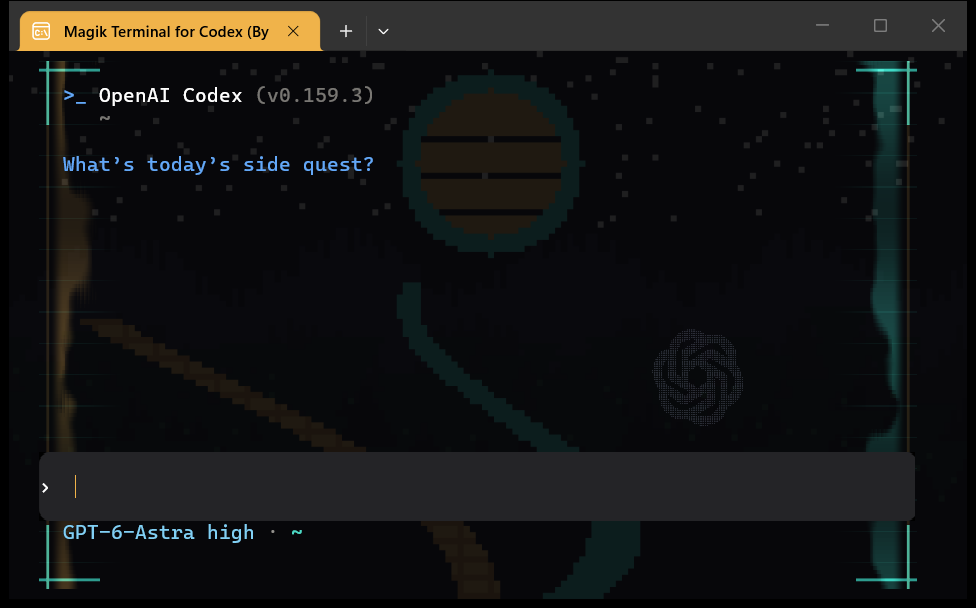
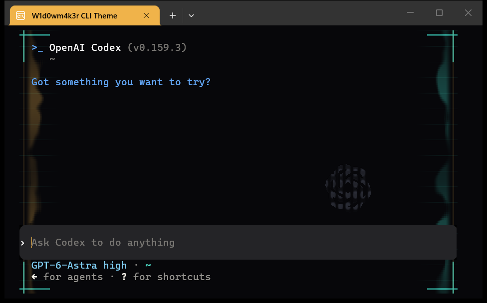

# Magik Terminal for Codex (By W1d0wm4k3r)

**Amber fire. Cyan signal. Your Codex, after dark.**

A free, MIT-licensed visual upgrade for Codex CLI, using the exact palette from
[B1SCU1TK1D](https://b1scu1tk1d.com/#magik-terminal): ink black, warm cream,
amber `#f0b34a`, and turquoise `#3be0c8`.



## Download

[Download Magik Terminal for Codex (By W1d0wm4k3r)](https://github.com/imperator-clawdius/magik-terminal/releases/latest/download/magik-terminal.zip)
or browse the [releases](https://github.com/imperator-clawdius/magik-terminal/releases).
The ZIP includes the installer, source, theme, shader, original pixel-art wallpaper (SVG + PNG), and license files.

[Download the separate macOS package](https://github.com/imperator-clawdius/magik-terminal/releases/latest/download/magik-terminal-macos.zip)
or [read the Hermes agent handoff PDF](docs/magik-terminal-hermes-handoff.pdf).

The name is **Magik Terminal for Codex (By W1d0wm4k3r)**. The repository,
`codex --magik` command, installation directory, and internal `widowmaker` theme ID
remain compatible with previous releases. The older download filename also remains available.

## Windows setup

Requires **Windows Terminal**, **PowerShell 5.1+**, **Python 3.11+ on PATH**, and an
installed, signed-in **Codex CLI with `/theme` support**. Tested with Codex 0.159.3
and Windows Terminal 1.24. The package is free; Codex access is separate.

1. Extract the ZIP.
2. Open PowerShell in the extracted folder.
3. Run:

```powershell
powershell -NoProfile -ExecutionPolicy Bypass -File .\install.ps1
```

This execution-policy override applies only to that installer process.
Open a **new PowerShell or Command Prompt**:

```powershell
codex --magik
codex --magik --yolo
```

`--magik` runs Codex in the current terminal tab, inheriting its working directory
and streams without opening another tab or window. `--yolo` explicitly maps
to Codex's `--dangerously-bypass-approvals-and-sandbox`: no approval prompts or
sandbox. It is never enabled by the theme on its own.

Local interactive Windows launches use Codex's `--no-daemon` so an Administrator
PowerShell session does not attach to a shared daemon started without elevation.
This also applies when opening the profile from the Terminal menu. Explicit
`--remote` connections are preserved.

Plain `codex` and automation commands pass through to your original Codex
installation, preserving arguments, streams, and exit codes. Extra arguments
such as `resume --last` are forwarded. The installed Codex syntax theme remains
active; terminal effects (flames, frame, and wallpaper) use the current terminal
profile. Select **Magik Terminal for Codex (By W1d0wm4k3r)** from the Terminal menu
for those effects. The launcher does not switch profiles or alter other profiles.

To make every new Windows Terminal window launch the theme, re-run:

```powershell
.\install.ps1 -DefaultProfile
```

The default profile is preserved unless you select that option. No PowerShell
startup-profile edits are needed. The installer adds command shims to
`~/.local/bin` and adds that directory to your user PATH if missing; fully quit
and reopen your terminal after installation if it still finds the old command.
If native Codex is on the machine-wide PATH ahead of the user PATH, invoke
`~/.local/bin/codex.cmd --magik` directly or adjust your PATH order.
For a restricted PowerShell execution policy, use `codex.cmd --magik`.
The installer does not change machine or user execution policy.

## What you get

- Animated digital flames in the side gutters, amber on the left and turquoise on the right.
- HUD corner brackets, circuit lines, and a branded tab and startup banner.
- A persistent Codex blossom in the bottom-right quarter, at 25% of its original width and height.
- Softer prompt/message-panel corners, composited without altering text or input.
- A persistent `widowmaker` Codex syntax theme for code, headings, and diffs.
- A matching terminal ANSI palette, with distinct added/deleted diff colors.
- The original blog pixel landscape, with a persistent on/off control.
- A quiet center: the shader masks text and keeps effects at the edges.
- A standalone Kitty color palette for macOS/Linux.
- A separate macOS instance using Ghostty, with a GLSL port of the animated visuals.

Codex's own interface layout and some UI colors remain controlled by Codex.
This is an independent theme/terminal integration, not an OpenAI product or a
fork of Codex. It does not change models, authentication, permissions, tools,
or the content of your prompts. It does not make the model generate colored
text; the terminal and syntax theme provide the colors.

The full install sets `tui.animations = false` so the large native welcome logo
does not appear behind the small persistent mark. This also disables native
shimmer/spinner motion; the theme shader supplies the flame animation. This
setting is backed up and restored on uninstall. Theme-only installs leave it alone.

The small mark stays visible with wallpaper on or off. On small windows it scales
down and moves above the prompt; very short windows hide it to keep input clear.
Reopen existing Codex sessions after upgrading to remove the old centered logo.

## Optional pixel-art wallpaper

The package includes the exact landscape from [B1SCU1TK1D](https://b1scu1tk1d.com).
The wallpaper is **off by default on a first installation**. Turn it on or off at
any time from a shell, without starting another Codex chat:

```powershell
codex --magik --wallpaper on
codex --magik --wallpaper off
codex --magik --wallpaper status
```

`--widowmaker` is also accepted in place of `--magik`, including with `--yolo`.
The setting is saved, survives restarts and reinstalls, and updates open themed
tabs when Windows Terminal reloads its settings. Then launch with `codex --magik`.
Do not combine a wallpaper settings command with a prompt or `--yolo`.

To enable it during installation, use `.\install.ps1 -Wallpaper on`.
Still mode and wallpaper are independent: `-NoMotion -Wallpaper on` gives you
a static wallpaper, frame, and Codex mark without the shader animation. No internet connection is
needed for the bundled wallpaper after download.

The image is blended at 10% opacity over ink black. The normal theme text colors
retain at least 4.5:1 contrast against even the brightest possible wallpaper
pixel; cream text exceeds 13:1. Solid prompt backgrounds, selection colors,
and Codex's own dimmed UI text remain controlled by the terminal/Codex.

| Wallpaper on | Wallpaper off |
| --- | --- |
|  |  |

## Still mode / uninstall

Re-run the installer with `-NoMotion` to freeze decorative animation:

```powershell
.\install.ps1 -NoMotion
.\install.ps1 -Uninstall
```

Still mode keeps the frame, frozen flames, optional wallpaper, and small Codex mark.
Uninstall restores byte-for-byte originals when installed files have not been
edited afterward. If you changed a file after installation, it is retained and
reported, with its original available in the backup record for manual recovery.
Close/reopen PowerShell after uninstall to refresh command discovery.

## Files changed

- `$CODEX_HOME/config.toml` (`tui.theme` and, for the full install, `tui.animations`), defaulting to `~/.codex`.
- `$CODEX_HOME/themes/widowmaker.tmTheme` and `$CODEX_HOME/magik-terminal/`.
- `~/.local/bin/codex.ps1` and `codex.cmd`, plus user PATH if needed.
- Windows Terminal `settings.json`, adding one profile and one color scheme.

Existing Terminal settings are retained semantically; JSONC comments and
formatting are normalized. Exact originals are saved in the private local
`$CODEX_HOME/magik-terminal/install-state.json`. **Do not publish that file:**
it contains backups of your local configuration. No backups leave your machine.
Use `python install.py --terminal-settings PATH` for a portable/custom Terminal install.
Use `--codex-executable PATH` for a native Codex executable in a custom location.

## macOS setup (separate Ghostty instance)

Install [Ghostty](https://ghostty.org/download), Python 3.11+, and a signed-in
Codex CLI with theme support. Requires Ghostty 1.2+ for background images; use a
current release. Use native Ghostty/Python/Codex builds for Apple Silicon or Intel.
The theme itself contains no architecture-specific Mac binaries.
Open Ghostty once after installing it to complete macOS's normal first-open prompt.

Extract `magik-terminal-macos.zip`, open a shell in that folder, then run:

```sh
sh install-macos.sh
# Open a new shell after installing:
codex --magik
codex --magik --yolo
```

The wrapper starts a **separate Ghostty application instance** with its own config
under `$CODEX_HOME/magik-terminal-macos/`. Your ordinary Ghostty configuration is
not changed. A GLSL shader provides flames, frame, rounded panels, and the small
Codex mark; the logo is embedded as dot data because Ghostty exposes one input texture.
Retina sizing follows cursor-cell height; exact geometry can differ from Windows.

The installer adds a backed-up PATH block to `~/.zshrc` and `~/.bash_profile`
and an executable `~/.local/bin/codex` shim. Pass `--no-shell-hook` to manage PATH
yourself. Set `--ghostty-app /path/to/Ghostty.app` or `--codex-executable /real/codex`
for custom installations. Existing conflicting shims are not overwritten.

```sh
codex --magik --wallpaper on
codex --magik --wallpaper off
codex --magik --wallpaper status
sh install-macos.sh --no-motion
sh install-macos.sh --motion
sh install-macos.sh --uninstall
```

Reopen the Magik window after changing wallpaper on Mac. Wallpaper and motion
choices survive Mac upgrades. The installer validates the generated config using
Ghostty itself. Apple Silicon and Intel CI validate configuration, isolated
installs, native command execution, argument forwarding, toggles, and uninstall.
The GUI smoke test opens separate Ghostty windows and verifies both normal and
explicit YOLO argument paths with a harmless sentinel. Native visual appearance
still needs acceptance on the recipient's display, especially Retina/external-display
sizing. The GUI check reports an explicit skip only if the system TextEdit app
cannot open; a Ghostty-specific failure still fails the check.

### Kitty / palette-only integration

```sh
python3 install.py --theme-only
```

Add `include /absolute/path/to/magik-terminal/themes/kitty.conf` to `kitty.conf`.
This provides the palette and Codex syntax theme. The HLSL animation and Windows
launcher do not run in Kitty. Other terminals can import `palette.json` manually.

## Develop

The [Hermes agent handoff](docs/magik-terminal-hermes-handoff.pdf) documents the
implementation, file map, safeguards, operational commands, and Mac/Windows
extension points. Its editable source is `tools/build-handoff.py`; regenerate
with `python tools/build-handoff.py` (development dependency: ReportLab).

```sh
python -m unittest discover -s tests -v
```

On Windows, `python tools/check-shader.py` compiles the shader with the system's
Direct3D compiler. No third-party Python packages are needed.

`python tools/build-macos-shader.py` regenerates the Ghostty GLSL port from the
Windows shader and logo SVG. With `glslangValidator` available, run
`python tools/check-macos-shader.py`. CI also validates Ghostty and runs isolated
native Mac sessions through `tools/smoke-macos.py --config-only` on both Mac
architectures. Run `python tools/smoke-macos.py` on a Mac desktop for the GUI test.

The shader uses Windows Terminal's experimental pixel-shader API. If a driver or
Terminal version rejects it, remove `experimental.pixelShaderPath` and
`experimental.pixelShaderImagePath` from the theme profile to keep the color
scheme and optional wallpaper. `-NoMotion` freezes animation but still uses
the shader for the frame, rounded panels, and persistent mark.

References: [Codex CLI customization](https://learn.chatgpt.com/docs/cli-customization),
[Windows Terminal shaders](https://learn.microsoft.com/en-us/windows/terminal/customize-settings/profile-appearance#pixel-shader-effects).

## License

Theme code and blog wallpaper: MIT. Free to use, modify, and share.
The Codex blossom asset is derived from Apache-2.0-licensed OpenAI Codex source;
see `assets/CODEX-LICENSE.txt` and `assets/README.md`. OpenAI marks remain their
property. Built for the B1SCU1TK1D universe, independently of OpenAI.
