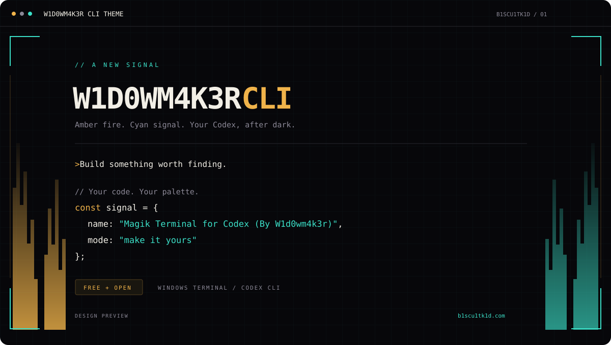

# Magik Terminal

**Amber fire. Cyan signal. Your Codex, after dark.**

A free, MIT-licensed visual upgrade for Codex CLI, using the exact palette from
[B1SCU1TK1D](https://b1scu1tk1d.com/#magik-terminal): ink black, warm cream,
amber `#f0b34a`, and turquoise `#3be0c8`.



## Download

[Download Magik Terminal](https://github.com/imperator-clawdius/magik-terminal/releases/latest/download/magik-terminal.zip)
or browse the [releases](https://github.com/imperator-clawdius/magik-terminal/releases).
The ZIP includes the installer, source, theme, shader, and license.

## Windows setup

Requires **Windows Terminal**, **PowerShell 5.1+**, **Python 3.11+ on PATH**, and an
installed, signed-in **Codex CLI with `/theme` support**. Tested with Codex 0.159.3
and Windows Terminal 1.24. The package is free; Codex access is separate.

1. Extract the ZIP.
2. Open PowerShell in the extracted folder.
3. Run:

```powershell
powershell -NoProfile -ExecutionPolicy Bypass -File .\install.ps1
```

This execution-policy override applies only to that installer process.
Open a **new PowerShell or Command Prompt**:

```powershell
codex --magik
codex --magik --yolo
```

`--magik` opens the themed profile in Windows Terminal. `--yolo` explicitly maps
to Codex's `--dangerously-bypass-approvals-and-sandbox`: no approval prompts or
sandbox. It is never enabled by the theme on its own.

Plain `codex` and automation commands pass through to your original Codex
installation, preserving arguments, streams, and exit codes. When already in a
Magik tab, the command stays in that tab. Extra arguments such as `resume --last`
are forwarded. You can also select **Magik Terminal** from the Terminal menu.

To make every new Windows Terminal window launch Magik, re-run:

```powershell
.\install.ps1 -DefaultProfile
```

The default profile is preserved unless you select that option. No PowerShell
startup-profile edits are needed. The installer adds command shims to
`~/.local/bin` and adds that directory to your user PATH if missing; fully quit
and reopen your terminal after installation if it still finds the old command.
If native Codex is on the machine-wide PATH ahead of the user PATH, invoke
`~/.local/bin/codex.cmd --magik` directly or adjust your PATH order.
For a restricted PowerShell execution policy, use `codex.cmd --magik`.
The installer does not change machine or user execution policy.

## What you get

- Animated digital flames in the side gutters, amber on the left and turquoise on the right.
- HUD corner brackets, circuit lines, and a branded tab and startup banner.
- Softer prompt/message-panel corners, composited without altering text or input.
- A persistent `magik` Codex syntax theme for code, headings, and diffs.
- A matching terminal ANSI palette, with distinct added/deleted diff colors.
- A quiet center: the shader masks text and keeps effects at the edges.
- A standalone Kitty color palette for macOS/Linux.

Codex's own interface layout and some UI colors remain controlled by Codex.
This is an independent theme/terminal integration, not an OpenAI product or a
fork of Codex. It does not change models, authentication, permissions, tools,
or the content of your prompts. It does not make the model generate colored
text; the terminal and syntax theme provide the colors.

## Still mode / uninstall

Re-run the installer with `-NoMotion` to disable the animated shader:

```powershell
.\install.ps1 -NoMotion
.\install.ps1 -Uninstall
```

The Codex colors remain in still mode; the shader flames and frame are disabled.
Uninstall restores byte-for-byte originals when installed files have not been
edited afterward. If you changed a file after installation, it is retained and
reported, with its original available in the backup record for manual recovery.
Close/reopen PowerShell after uninstall to unload the functions.

## Files changed

- `$CODEX_HOME/config.toml` (only `tui.theme`), defaulting to `~/.codex`.
- `$CODEX_HOME/themes/magik.tmTheme` and `$CODEX_HOME/magik-terminal/`.
- `~/.local/bin/codex.ps1` and `codex.cmd`, plus user PATH if needed.
- Windows Terminal `settings.json`, adding one profile and one color scheme.

Existing Terminal settings are retained semantically; JSONC comments and
formatting are normalized. Exact originals are saved in the private local
`$CODEX_HOME/magik-terminal/install-state.json`. **Do not publish that file:**
it contains backups of your local configuration. No backups leave your machine.
Use `python install.py --terminal-settings PATH` for a portable/custom Terminal install.
Use `--codex-executable PATH` for a native Codex executable in a custom location.

## Kitty and other terminals

```sh
python3 install.py --theme-only
```

Add `include /absolute/path/to/magik-terminal/themes/kitty.conf` to `kitty.conf`.
This provides the palette and Codex syntax theme. The HLSL animation and Windows
launcher do not run in Kitty. Other terminals can import `palette.json` manually.

## Develop

```sh
python -m unittest discover -s tests -v
```

On Windows, `python tools/check-shader.py` compiles the shader with the system's
Direct3D compiler. No third-party Python packages are needed.

The shader uses Windows Terminal's experimental pixel-shader API. If a driver or
Terminal version rejects it, install with `-NoMotion`. Animation uses GPU power;
still mode is also useful on battery.

References: [Codex CLI customization](https://learn.chatgpt.com/docs/cli-customization),
[Windows Terminal shaders](https://learn.microsoft.com/en-us/windows/terminal/customize-settings/profile-appearance#pixel-shader-effects).

## License

MIT. Free to use, modify, and share. Built for the B1SCU1TK1D universe.
